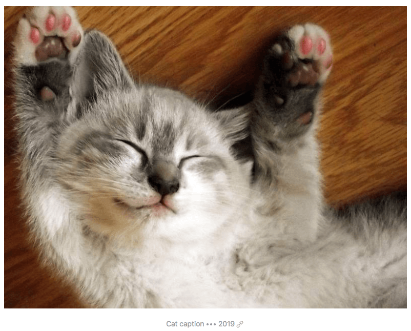

# Elana Shortcode Plugin

## About

The **Elana Shortcode** plugin provides several useful UI elements for Grav as _shortcodes_. As such it requires the **Shortcode Core** plugin to function.

It currently provides:

* Switcher
* Alert
* Gallery
* Image
* Maps
* Columns
* Youtube

## Installation

Typically a plugin should be installed via [GPM](http://learn.getgrav.org/advanced/grav-gpm) (Grav Package Manager):


!! **NOT AVAILABLE**


Alternatively it can be installed via the [Admin Plugin](http://learn.getgrav.org/admin-panel/plugins)

## Configuration Defaults

There is currently only one main plugin option for **Elana Shortcode** and that is to set a default theme for the tabs shortcode.  As this plugin requires the **Elana Shortcode** functionality there are some configuration options there that will effect this one.  For example setting the default `active` state to `false` will also cause this plugin to not function.

```
enabled: true
```

## Per-Page Configuration

## Available Shortcodes

This plugin provides a variety of plugins, each with a specific purpose:

#### Switcher

An example of the Tabs shortcode is as follows:

[prism classes="language-markdown line-numbers"]
[raw]
[ui-switchers tab="1" anim="fade" align="center" button="0" color="primary"]
[ui-switcher title="First Tab"]

In tempor sed sapien eu porttitor. Aliquam cursus facilisis ante. Etiam neque nunc, blandit vel lacus et, faucibus accumsan lacus. Proin posuere varius purus quis faucibus. Quisque et enim vitae orci [placerat tincidunt](#) id ac eros. Fusce et gravida libero.

Phasellus cursus odio ex, in **mattis lorem tincidunt** vel. Donec nibh odio, dapibus non ligula a, semper ornare massa. Nulla consectetur eu nunc sed ultrices. Integer at turpis dolor.

[/ui-switcher]
[ui-switcher title="Second Tab"]

In tempor sed sapien **eu porttitor**. Aliquam cursus facilisis ante. Etiam neque nunc, blandit vel lacus et, faucibus accumsan lacus. Proin posuere varius purus quis faucibus. [Quisque et enim](#) vitae orci placerat tincidunt id ac eros. Fusce et gravida libero.

Phasellus cursus odio ex, in mattis lorem tincidunt vel. [Donec nibh odio](#), dapibus non ligula a, semper ornare massa. Nulla consectetur eu nunc sed ultrices. Integer at turpis dolor.

[/ui-switcher]
[/ui-switchers]
[/raw]
[/prism]

The <code>[raw][ui-switchers][/raw]</code> shortcode has some optional parameters:

* `tab` Tab effect can be `true` or `false` - (true by default)
* `anim` smooth animations can be `fade`, `scale-up`, `scale-down` ... (fade by default) [See all kind of anim](/components/animation)
* `align` modify the alignment of the navigations, can be `left`, `right` or `center` (center by default)
* `button` Button style can be `true` or `false` - (false by default)
* `color` modify the button's style, can be `primary`, `secondary` or `center` (center by default)

The <code>[raw][ui-switcher][/raw]</code> shortcode that defines each _tab_ has the following parameters:

* `title` - The text to display for the actual tab title

You can use whatever markdown you wish in the tab itself.  They are auto-adjusting and fully responsive.

##### Example


#### Alert

An example of the Alert shortcode is as follows:

[prism classes="language-markdown line-numbers"]
[raw]
[ui-alert title="Alert Box Title" close="1" color="danger" padding="small" style="h3" icon="warning"]
In tempor sed sapien eu porttitor. Aliquam cursus facilisis ante. Etiam neque nunc, blandit vel lacus et, faucibus accumsan lacus. Proin posuere varius purus quis faucibus. Quisque et enim vitae orci [placerat tincidunt](#) id ac eros. Fusce et gravida libero.

Phasellus cursus odio ex, in **mattis lorem tincidunt** vel. Donec nibh odio, dapibus non ligula a, semper ornare massa. Nulla consectetur eu nunc sed ultrices. Integer at turpis dolor.
[/ui-alert]
[/raw]
[/prism]

The <code>[raw][ui-alert][/raw]</code> shortcode has some optional parameters:

* `title` - The text to display for the actual Alert box title
* `close` create a close button and enable its functionality can be `true` or `false` - (true by default)
* `style` There are several style modifiers available, can be `div`, `p`, `h1` to `h6` (h3 by default)
* `padding` add spacing, can be `small` or `large` (small by default)
* `color` There are several style modifiers available, can be `primary`, `success`, `warning` or `danger` (center by default)
* `icon` add scalable vector icons, can be `user`, `home`, `lock` ... (none by default) [See all kind of icons](/components/icons)

##### Example


#### Gallery

This shortcode ...

[prism classes="language-markdown line-numbers"]
[raw]
[ui-gallery][/ui-gallery]
[/raw]
[/prism]

##### Example


#### Image

This shortcode display an image with our without a responsive lightbox.

[prism classes="language-markdown line-numbers"]
[raw]
[uikit-image shadowbottom="1" lightbox="1" padding="small" shadow="small" caption="Image Caption"]

[/uikit-image]
[/raw]
[/prism]

The <code>[raw][ui-image][/raw]</code> shortcode has some optional parameters:

* `lightbox` create a responsive lightbox can be `true` or `false` - (true by default)
* `padding` add spacing, can be `small` or `large` (small by default)
* `shadowbottom` Apply a box shadow at the bottom of map,can be `true` or `false` - (true by default)
* `shadow` apply different box shadows to map, can be `small`, `medium`, `large` or `xlarge` (small by default)
* `figcaption` defines a caption for image
* `copyright` defines a copyright for image
* `copyright-link` Add an URL to copyright

##### Example


#### Maps

This shortcode show a Google Map through API.

[prism classes="language-markdown line-numbers"]
[raw][ui-maps shadowbottom="1" shadow="small" place="cap d’Agde" maptype="roadmap" zoom="15" lang="fr"][/ui-maps][/raw]
[/prism]

* `lang` customize your map for a specific country. - (fr by default)
* `zoom` zoom level of map. Use number.  - (13 by default)
* `maptype` apply different map type, can be `roadmap`, `satellite`, `hybrid` or `terrain` (roadmap by default)
* `place` Adress of you location
* `shadowbottom` Apply a box shadow at the bottom of map,can be `true` or `false` - (true by default)
* `shadow` apply different box shadows to map, can be `small`, `medium`, `large` or `xlarge` (small by default)

##### Example


#### Columns

[prism classes="language-markdown line-numbers"]
[raw]
[ui-columns][/ui-columns]
[/raw]
[/prism]

##### Example

#### Youtube

This shortcode embed a responsive Youtube video, can be inside a responsive lightbox.

[prism classes="language-markdown line-numbers"]
[raw]
[ui-youtube id="11Wh8RzcQZr4" lightbox="1" automute="1" autoplay="1" padding="small" btnlabel="Video Caption"][/ui-youtube]
[/raw]
[/prism]

* `id` Youtube video ID
* `lightbox` create a responsive lightbox can be `true` or `false` - (false by default)
* `autoplay` autoplay the video, can be `true` or `false` - (false by default)
* `automute` automute the video, can be `true` or `false` - (false by default)
* `padding` add spacing, can be `small` or `large` (small by default)
* `btnlabel` defines a button label to open a lightbox

##### Example


