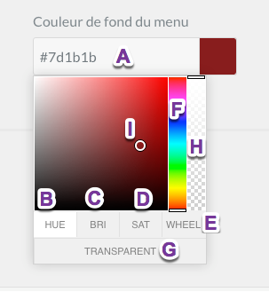
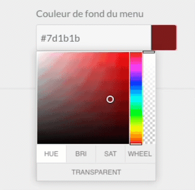

Nous savons que les couleurs font partie intégrante de la création de votre site internet. Un bon choix de couleurs rend votre site plus professionnel et plus agréable à visiter. C'est la raison pour lesquelles vous trouverez dans les différentes parties de l'administation des sélecteurs de couleurs. Vous pourrez gérer tous les paralètres avec facilités. La transparence est également disponible ainsi que d'autres paramètres. Si vous désirez en apprendre davantage sur cette fonction essentiel, lisez la suite ci-dessous.

## Comment utiliser le sélecteur de couleur ?

| Zone | Description |
| ----- | ----------- |
| A   	 | Code Hexa de la couleur. Vous pouvez également indiquez taper un code. |
| B 	 | Vous permet de choisir une couleur en fonction de la teinte. |
| C    	 | Vous permet de choisir une couleur en fonction de la luminosité. |
| D    	 | Vous permet de choisir une couleur en fonction de la saturation. |
| E    	 | Vous permet d'utiliser une roue des couleurs de base, une méthode préférée de sélection de couleur par beaucoup. |
| F    	 | Curseur pour choisir sa couleur en fonction de la _Saturation_; _luminosité_ ou _teinte_. |
| G    	 | Bascule en mode Transparent RGBA. |
| H    	 | Curseur pour régler la transparence d'une couleur donnée. |
| I    	 | Faites glisser le cercle avec votre souris dans le spectre de couleur afin de choisir une couleur. |

### Exemple
