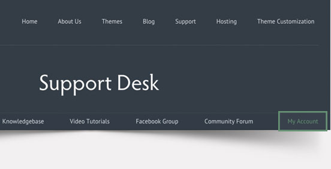
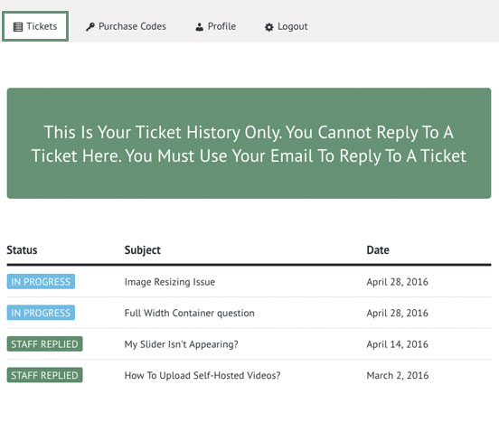
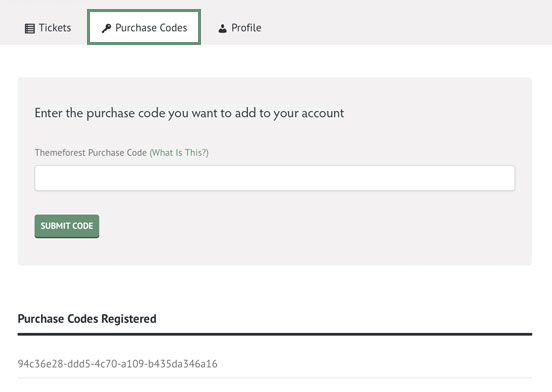
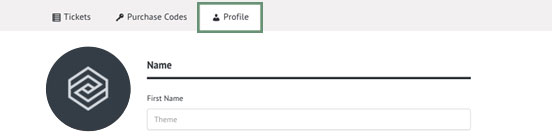

### Comment accéder au support ?

| Étape | Description |
| ------ | ----------- |
| 1   | Allez sur le site de [Elanathemes](https://www/elanathemes.fr/support) |
| 2 | Accédez à la page Support, puis connectez-vous avec votre nom d'utilisateur et mot de passe. |
| 3    | Accédez à la page Mon compte. |
| 3    | Une fois connectez, vous verrez 3 onglets ; l'onglet Tickets , l'onglet Licence , et l'onglet Profil. |

### Suivi des tickets

| Option | Description |
| ------ | ----------- |
| data   | path to data files to supply the data that will be passed into templates. |
| engine | engine to be used for processing templates. Handlebars is the default. |
| ext    | extension to be used for dest files. |

### Votre licence

| Option | Description |
| ------ | ----------- |
| data   | path to data files to supply the data that will be passed into templates. |
| engine | engine to be used for processing templates. Handlebars is the default. |
| ext    | extension to be used for dest files. |

### Votre profile

| Option | Description |
| ------ | ----------- |
| data   | path to data files to supply the data that will be passed into templates. |
| engine | engine to be used for processing templates. Handlebars is the default. |
| ext    | extension to be used for dest files. |

